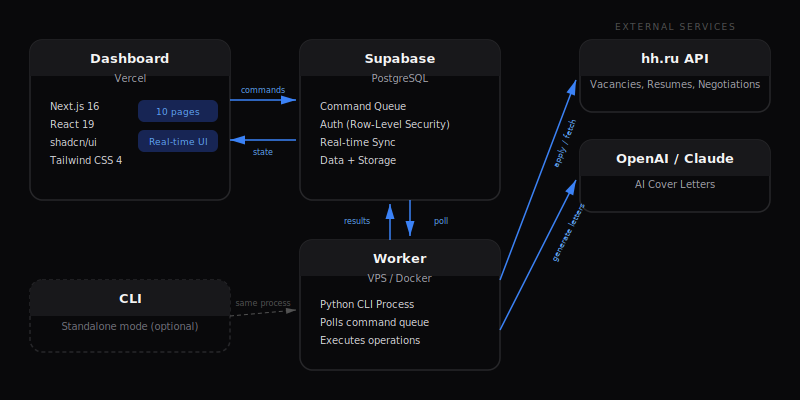

[Русская версия](docs/README_RU.md)

# hh-applicant-tool

[](https://www.python.org/downloads/)
[](https://nextjs.org/)
[](LICENSE)
[](https://supabase.com/)

> Automated job application engine for [HeadHunter (hh.ru)](https://hh.ru) with AI-powered cover letters, a real-time dashboard, and a remote worker architecture. Self-hosted — each user runs their own instance with their own database.

<p align="center">
  
</p>

## Features

- **Auto-apply** to vacancies matching your search query with configurable filters
- **AI cover letters** generated per-vacancy via OpenAI GPT-4o or Claude, mimicking natural human writing
- **Auto-reply** to employer messages with context-aware AI responses
- **Resume management** -- periodic resume refresh to stay on top of recruiter searches, cloning, listing
- **Real-time dashboard** -- monitor applications, control the worker, review negotiations
- **Remote worker** -- headless process on a VPS, driven by a Supabase command queue
- **Setup wizard** for easy configuration of Supabase, environment variables, and hh.ru authorization
- **Multi-profile support** -- manage multiple HH accounts from a single installation
- **Telegram notifications** for key events (optional)
- **Proxy and cookie support** for flexible network configurations

## Architecture

```
Dashboard (Vercel)  --->  Supabase (PostgreSQL)  <---  Worker (VPS / Docker)
       |                        |                           |
   Next.js app            Queue + Data               Python CLI process
   React 19 UI            Auth, storage              Polls commands,
   shadcn/ui              Real-time sync             executes operations
```

Each user creates their own **Supabase** project -- there is no shared backend. Your data stays in your own database.

<p align="center">
  
</p>

The **dashboard** is a Next.js application deployed on Vercel (or locally). It writes commands and reads state from Supabase. The **worker** is a long-running Python process (managed via systemd or Docker) that polls the Supabase command queue, executes CLI operations against the hh.ru API, and writes results back. The **CLI** can also be used standalone without the dashboard or worker.

## Screenshots

<details>
<summary><strong>Dashboard pages (click to expand)</strong></summary>

### Overview — KPI & activity chart

| Dark | Light |
|------|-------|
|  |  |

### Operations — command center

| Dark | Light |
|------|-------|
|  |  |

### Negotiations — application tracking

| Dark | Light |
|------|-------|
|  |  |

### Vacancies

| Dark | Light |
|------|-------|
|  |  |

### Logs — real-time execution logs

| Dark | Light |
|------|-------|
|  |  |

### Login — glassmorphism design

| Dark | Light |
|------|-------|
|  |  |

</details>

## Tech Stack

| Component | Technology |
|-----------|-----------|
| CLI | Python 3.11+, argparse, requests, SQLAlchemy |
| AI | OpenAI GPT-4o, Anthropic Claude (via CLI) |
| Dashboard | Next.js 16, React 19, Tailwind CSS 4, shadcn/ui, Radix UI |
| Database | Supabase (PostgreSQL) for shared state, SQLite for local storage |
| Worker | Python, systemd / Docker |
| Deploy | Docker, docker-compose, Vercel |

## Quick Start

### Prerequisites

- Python 3.11+
- Node.js 20+ (for the dashboard)
- An [hh.ru](https://hh.ru) account with API access (`client_id` / `client_secret`)

### Installation

```bash
pip install hh-applicant-tool
```

Or from source:

```bash
git clone https://github.com/s3rgeym/hh-applicant-tool.git
cd hh-applicant-tool
pip install -e .
```

### Authorize with hh.ru

```bash
hh-applicant-tool authorize
```

This opens a browser for OAuth authentication. Your token is saved locally.

### Configure Supabase (for dashboard mode)

```bash
hh-applicant-tool setup
```

The setup wizard will ask for your Supabase URL and keys, then generate the `.env` files. See [Supabase Setup](docs/supabase-setup.md) for detailed instructions.

### Start the Dashboard

```bash
cd dashboard
npm install
npm run dev
```

The dashboard will be available at `http://localhost:3000`.

### CLI Usage

```bash
# Show all available commands
hh-applicant-tool --help

# Auto-apply to vacancies matching a search query with AI cover letters
hh-applicant-tool apply-vacancies --search "Python developer" --use-ai

# Reply to employer messages using AI
hh-applicant-tool reply-employers --use-ai

# Refresh resumes to stay visible to recruiters
hh-applicant-tool update-resumes

# List your resumes
hh-applicant-tool list-resumes

# Show current user info
hh-applicant-tool whoami
```

## Self-Hosting Guide

The full setup involves three components. Follow the guides in order:

1. **[Supabase Setup](docs/supabase-setup.md)** -- Create your database and run the schema migration
2. **[Dashboard Deployment](docs/dashboard-deploy.md)** -- Deploy the Next.js dashboard (Vercel, local, or Docker)
3. **[Worker Deployment](docs/worker-deploy.md)** -- Run the worker on a VPS or in Docker

## Docker

```bash
# Copy and configure environment
cp .env.example .env

# Run the worker (dashboard-driven mode)
docker-compose --profile worker up -d

# Or run in legacy cron mode
docker-compose --profile cron up -d
```

## Environment Variables

| Variable | Required | Description |
|----------|----------|-------------|
| `SUPABASE_URL` | Yes (worker) | Supabase project URL |
| `SUPABASE_SERVICE_KEY` | Yes (worker) | Supabase service role key |
| `NEXT_PUBLIC_SUPABASE_URL` | Yes (dashboard) | Supabase project URL |
| `NEXT_PUBLIC_SUPABASE_ANON_KEY` | Yes (dashboard) | Supabase anon public key |
| `DASHBOARD_SECRET` | Yes (dashboard) | Password for dashboard authentication |
| `HH_PROFILE_ID` | No | Profile subdirectory name for multi-account setups |
| `TG_BOT_TOKEN` | No | Telegram bot token for notifications |
| `TG_CHAT_ID` | No | Telegram chat ID for notifications |
| `CONFIG_DIR` | No | Custom config directory (default: `~/.config/hh-applicant-tool`) |

See [`.env.example`](.env.example) for a full template.

## Documentation

- [Supabase Setup](docs/supabase-setup.md) -- Database configuration and schema migration
- [Dashboard Deployment](docs/dashboard-deploy.md) -- Vercel, local, and Docker deployment
- [Worker Deployment](docs/worker-deploy.md) -- systemd, Docker, and deploy script options

## Project Structure

```
hh-applicant-tool/
  src/hh_applicant_tool/
    main.py              # CLI entry point
    operations/          # CLI commands (apply, reply, authorize, etc.)
    ai/                  # AI providers (OpenAI, Claude)
    api/                 # HH.ru API client
    storage/             # SQLite storage layer
    worker.py            # Remote worker process
    utils/               # Shared utilities
  dashboard/             # Next.js dashboard app
  deploy/                # Deployment configs (systemd, deploy script)
  docs/                  # Documentation
  docker-compose.yml     # Docker services
  pyproject.toml         # Python project config
```

## License

MIT
